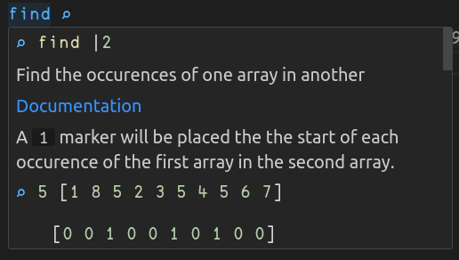

<!---
Le contenu attendu des présentation et rapports intermédiaires est:

- présentation du langage et motivation du choix
- aspects particuliers, exemples
- choix du projet et motivation
- aperçu du cahier des charges

Le temps alloué est au maximum de 15 minutes, le contenu du rapport de 4 pages au maximum.
-->

# Présentation du langage
Nous avons choisi le langage `Uiua`. C'est un langage de programmation orienté liste et basé sur l'utilisation d'un stack. Il est fortement influencé par `APL` et `BQN`. Le langage est à la fois interprétable et compilable. L'interpréteur et le compilateur sont écrit en `Rust` et est disponible sur [`crates.io`](https://crates.io/crates/uiua). Il est aussi intégrable en tant que librairie dans un projet `Rust`.

Il est très concis et permet d'effectuer des opérations sur des listes d'éléments plutôt que sur des éléments individuels.

      
    <i>Logo de Uiua et code utilisé pour le générer</i>

<!---
Montrer l'example du logo de Uiua
-->

La plupart des fonctions intégrées à Uiua sont représentées par des symboles, ce qui rend la lecture du code plus difficile mais permet de réduire la taille du code. Les symboles sont toutefois choisis pour repésenter au mieux la fonction (example `sin` est associé à `∿`). 

Afin de ne pas avoir à utiliser un clavier spécial, les fonctions sont aussi accessibles via leur nom. L'outil de compilation permet d'automatiquement remplacer les noms par les symboles correspondants. 

     
    <i>Différents symboles et leur nom</i>

<!--- 
Montrer plusieurs symboles et leur nom associé
-->

Malgré les symboles, l'intégration aux environnements de développement permet de voir les symboles sous forme de texte ainsi qu'une partie de la documentation associée.

     
    <i>Intégration dans VSCode</i>

<!---
Screenshot de l'intégration dans VSCode
-->

## Types de données

    <table>
        <tr>
            <td width=320>
                Uiua ne possède que quelques types de données: les nombres, les charactères, les listes et les "box". 
                  
                Les nombres peuvent être des entiers, des flottants et des nombres complexes. Les caractères sont des caractères unicode. 
                Les listes sont des listes d'éléments de même type. 
                Et les "box" permettent de stocker des éléments de différents types dans une même liste.  
                Une grande partie des fonctions sont dites "pervasives" afin de pouvoir manipuler une liste de box sans avoir besoin de les déballer.
            <td>
            <td>
                

                     
                    <i>Représentation des types de données</i>
                

            </td>
        </tr>
    </table>

<!---
Montrer les représentations des types de données dans la console
-->

Les chaines de caractères sont représentées par des listes de charactères mais du sucre syntaxique est disponible pour les déclarer. Une liste de box peut aussi être déclarée de manière plus lisible.

     
    <i>Sucre syntaxique pour les chaines de caractères et les listes de box</i>

<!---
Montrer la déclaration de chaines de caractères et de listes de box manuelle et avec le sucre syntaxique
-->

## Fonctions
Les fonctions sont définies par des symboles ou des noms. Il n'a pas de paramètres nommés: ils sont directement extraits du stack et les valeur de retour sont placées sur le stack. La plupart du temps la signature est inférée par le compilateur mais il est parfois nécessaire de spécifier le nombre de paramètres attendus et retournés (par example pour les fonctions récursives).

## Fonctions système
Uiua possède un certain nombre de fonctions système qui permettent d'accéder à des fonctionnalités de bas niveau (système de fichiers, sockets, appel de commandes) ainsi que des fonctions pour différent types de médias (images, sons et gifs).

<!---
Montrer les deux slides de présentation des fonctions
-->

### Foreign Function Interface
Il est aussi possible d'appeler des fonctions définies dans des librairies externes. Cela permet d'étendre les fonctionnalités de Uiua en utilisant des librairies écrites en Rust, C ou C++ par exemple.

# Motivation du choix
Le paradigme est totalement différent de ce que nous avons l'habitude de voir ce qui force un changement drastique de réflexion. Les possibilités avec les types de médias nous ont aussi beaucoup intéressé pour le projet.

# Projet
Notre projet consiste en une application graphique permettant de générer des images de manière paramétrique. L'interface graphique sera réalisée en utilisant la librairie `raylib` et permettra de démontrer les capacitées de la `FFI`. La génération d'image permet de montrer les capacités de manipulation de données multi-dimensionelles du language, les fonctions de manipulation de format d'image ainsi que les fonctions système pour la sauvegarde de fichiers.

# Aperçu du cahier des charges

- Interface graphique simple
    - Modification en temps réel des paramètres
- Génération d'images paramétriques
    - Formes pré-définies (cercles, carrés, ...)
    - Courbes paramétriques (Bézier)
- Sauvegarde des images générées
    - Choix du format (PNG, JPEG, BMP, ICO, QOI)
    - Choix du nom